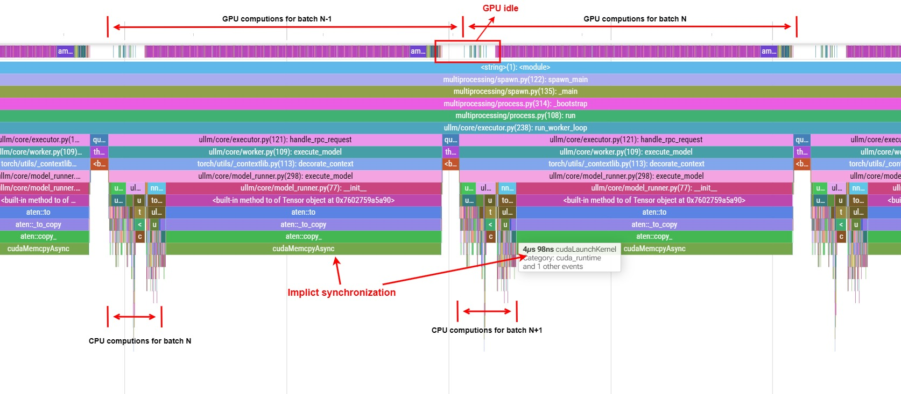
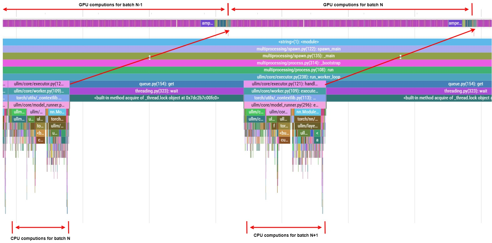

# Fully Async Scheduling

## 简介

在 LLM 推理引擎中，Scheduler 和 Worker 之间的通信以及 CPU-GPU 之间的数据拷贝往往会成为系统的性能瓶颈。在最新的更新中，我们引入了全异步调度 (Fully Asynchronous Scheduling) 特性。该特性的核心目标是通过将请求状态下放并张量化，且引入 CUDA 异步流与事件机制，实现调度和模型执行的并行重叠，从而大幅提升 GPU 利用率和整体吞吐量。

## 核心设计

**1. 独立的请求状态管理 (`RequestState`)**

为了减少 Python 对象的开销和提升状态更新效率，引入 `RequestState` 模块 (`ullm/core/req_state.py`) 来在 `ModelRunner` 内部维护每个请求的状态：
- **预分配内存**: 为 `new_token_ids`、`kv_indices`、`num_new_tokens` 等预先分配了固定大小的 CPU Tensor。
- **GPU 侧状态留存**: 将最后一次生成的 token (`last_sampled_token`) 直接留存在 GPU 上。在 Decode 阶段，Worker 会将输入组装中的 `-1` 占位符转化为上一步留在 GPU 上的生成结果。这允许下一步计算直接在 Device 端闭环发起，无需等待调度器将上一步的结果从 CPU 重新传回。

`RequestState` 仅保留必要的请求状态信息，并且所有状态在全部保存在 CPU Tensor 中（除了 `last_sampled_token`），以便请求状态更新可以和 GPU 计算完全解耦。

**2. 调度器通信极简开销**

调度器的下发负载 (`SchedulerOutput`) 被大幅精简：
- **Prefill 阶段**: `ScheduledNewSequence` 仅发送未缓存的 tokens。
- **Decode 阶段**: 如果序列存在 `placeholder_tokens`，调度器只需发送轻量级的占位符 `-1`，Worker 凭借本地的张量状态即可完成推理。

该特性即增量式地请求状态更新，极大地减小了调度器与 Worker 之间的通信负载，此后不需要在每个 step 都向 Worker 发送完整的 Sequence 信息。

**3. Persistent Input Batch**

Worker 内部维护一个持久化的输入 Batch (`self.input_batch`)，用于存储模型执行所需要的所有 GPU 输入张量。ModelRunner 在每次调度器下发新请求时仅更新该 Batch，然后异步地将 CPU Tensor 传输到 GPU 上。该过程全程无显示或隐式同步。

**4. 全部异步化的 Model Runner**

Model Runner 的执行流程被全面异步化，调度器下发请求后，Model Runner 进行数据传输和 GPU 计算不会和 CPU 发生任何同步等待。在计算最后，Model Runner 会返回一个 `ModelOutput`，其中包含一个 CUDA Event。存在一个独立的线程持续等待该 Event 的完成，一旦 Event 完成，线程会将生成结果从 GPU 传回 CPU。

改造之前，Worker 在每一步都需要等待调度器下发完整的 Sequence 信息，并且在 GPU 计算完成后需要等待结果传回 CPU，这导致 GPU 空闲时间较长，无法充分利用 GPU 资源。完成上述改造后，Worker 上 GPU 空闲时间会得到极大减少：

另外在每一个 Worker 上的 CPU 操作都可以和 GPU 计算完全重叠：

通过 profiler 的分析，我们可以看到引入全异步调度后，Worker 上的 GPU 计算和 CPU 操作得以完全重叠：

开启全异步调度前：

开启全异步调度后：

