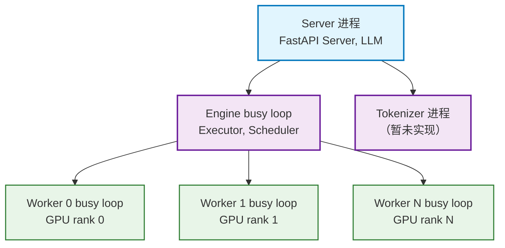
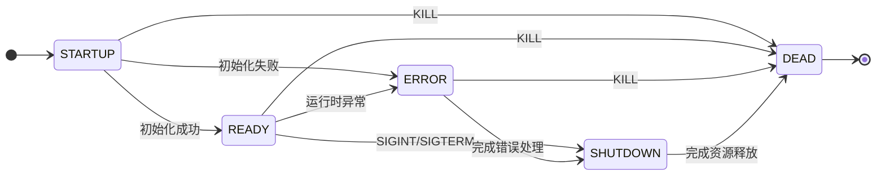

# Multiprocessing Design

## Process Architecture

该项目采用多进程架构实现多卡并行推理服务，在进程设计上存在三层树状结构：



- **Server 进程**：作为主进程，运行 FastAPI 服务器，处理用户请求，并与下层的 Engine 进程通信。该进程负责接收输入文本，调用 Tokenizer（如果有）进行分词，然后将分词结果发送给 Engine 进程进行推理。Server 进程包含一个 LLM 类实例，负责与 Engine 进程进行交互。
- **Engine 进程**：作为中间层，负责调度和管理多个 Worker 进程。Engine 进程接收来自 Server 进程的请求，分发给各个 Worker 进程进行推理计算。Engine 进程包含一个 Engine 类实例，Engine 中又包含一个 Executor 类实例和一个 Scheduler 类实例。Executor 负责请求 Worker 执行 RPC 调用，Scheduler 负责调度请求。
- **Worker 进程**：作为底层计算单元，负责实际的模型推理计算。每个 Worker 进程绑定到一个 GPU 设备，接收来自 Engine 进程的 RPC 请求，执行模型推理，并将结果返回给 Engine 进程。Worker 进程包含一个 Worker 类实例，负责处理来自 Executor 的 RPC 调用。Worker 又包含了 ModelRunner 类实例，负责加载和运行具体的模型。

## Process Lifecycle

每个子进程都遵循以下生命周期设计：

### States

|状态 |说明|
|---|---|
|STARTUP|进程启动，初始化资源|
|READY|进程准备就绪，等待任务|
|ERROR|进程发生错误，进入错误处理|
|SHUTDOWN|进程进入关闭步骤，进行清理并退出|
|DEAD|进程已终止，资源已释放|

### Diagram



## Implementation

为了实现上述多进程设计，统一使用 spawn 方式创建子进程，并定义子进程事件类，使用 Pipe 建立子进程向父进程的通信管道：

```python
class EventType(enum.Enum):
    STARTUP = enum.auto()
    READY = enum.auto()
    SHUTDOWN = enum.auto()
    ERROR = enum.auto()
    DEAD = enum.auto()

@dataclass
class Event:
    type: EventType
```

子进程统一按照一下模板创建顶层循环：

```python
def run_busy_loop(
    # 其他参数...
    report_pipe: Connection
):
    report_pipe.send(Event(EventType.STARTUP))
    shutdown_requested = False
    def signal_handler(signum, frame):
        if not shutdown_requested:
            raise SystemExit()
    signal.signal(signal.SIGTERM, signal_handler)
    signal.signal(signal.SIGINT, signal_handler)

    try:
        # 执行初始化逻辑
        report_pipe.send(Event(EventType.READY))

        while True:
            ...  # 执行主循环逻辑
    except SystemExit:
        pass  # 尝试正常退出
    except Exception:
        try:
            report_pipe.send(Event(EventType.ERROR))
        except (BrokenPipeError, OSError):
            pass  # 管道已关闭是正常的
    finally:
        shutdown_requested = True
        try:
            report_pipe.send(Event(EventType.SHUTDOWN))
        except (BrokenPipeError, OSError):
            pass  # 管道已关闭是正常的
        # 执行资源清理逻辑
```

同时在父进程实现一个 MPClient 类，不限制 MPClient 是否监听子进程事件，但是必须实现监听子进程死亡事件：

```python

def shutdown(procs: list[BaseProcess] | BaseProcess):
    proc_list = procs if isinstance(procs, list) else [procs]
    # Shutdown the process.
    for proc in proc_list:
        if proc.is_alive():
            proc.terminate()

    # Allow 5 seconds for remaining procs to terminate.
    deadline = time.monotonic() + 5
    for proc in proc_list:
        remaining = deadline - time.monotonic()
        if remaining <= 0:
            break
        if proc.is_alive():
            proc.join(remaining)

    for proc in proc_list:
        if proc.is_alive() and (pid := proc.pid) is not None:
            kill_process_tree(pid)

class MPClient:
    def __init__(self):
        self.is_dead = False
        self.mp_ctx = mp.get_context("spawn")
        report_reader, report_writer = self.mp_ctx.Pipe(duplex=False)
        self.report_pipe = report_reader
        self.process = self.mp_ctx.Process(
            target=run_busy_loop,
            args=(... , report_writer),
            daemon=True,
        )
        self._finalizer = weakref.finalize(self, shutdown, self.process)
        self.start_engine_monitor()
    
    def shutdown(self):
        self._finalizer()

    def start_engine_monitor(self):

        weak_self = weakref.ref(self)
        def dead_monitor():
            _died = wait([self.process.sentinel])
            self_ref = weak_self()
            if not self_ref:
                return
            self_ref.is_dead = True
            self_ref.shutdown()

        self.dead_monitor_thread = threading.Thread(
            target=dead_monitor,
            name="dead-monitor",
            daemon=True,
        )
        self.dead_monitor_thread.start()
```
