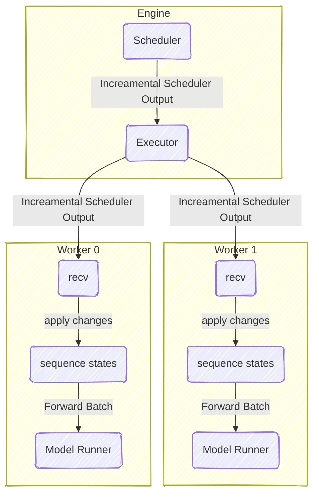

# Scheduler Design

## Overview

调度器运行在 Engine 组件中，负责调度请求和管理 KV Cache。在说明调度器设计之前，需要先定义一个请求（在该项目中对应 `Sequence` 类）的生命周期和基本结构。

## Sequence
基本上可以认为，`Sequence` 包含了一个请求的所有 token 和已缓存的 KV Cache。除了这些核心数据外，`Sequence` 还具有一个 `status` 字段，用于表示请求的当前状态。

```python
@dataclass
class Sequence:
    seq_id: str # Unique identifier for the sequence
    status: SequenceStatus # Enum: WAITING, RUNNING, FINISHED
    tokens: list[int] # token 列表
    cached_kv_indices: list[int]  # 已计算的 token 对应的 KV Cache 索引
    new_kv_indices: list[int] # 未计算的 token 对应的 KV Cache 索引
    ...
```

## Scheduler

为了实现一个调度器，我们需要使用两个队列：

- `waiting_queue`：存储所有处于 `WAITING` 状态的请求。
- `running_queue`：存储所有处于 `RUNNING` 状态的请求。

调度器的核心逻辑如下：

1. **ADD**：当一个新的请求到达时，将其添加到 `waiting_queue` 中，并将其状态设置为 `WAITING`。
2. **SCHEDULE**：调度器从 `waiting_queue` 和 `running_queue` 中选择请求进行处理。优先选择 `running_queue` 中的请求，以确保正在处理的请求能够尽快完成。然后从 `waiting_queue` 中选择请求，直到达到最大并发限制。最后进行 KV Cache 分配。
3. **PREEMPT**：如果资源不足以处理新的请求，调度器可以选择预先抢占（preempt）某些正在运行的请求，释放其 KV Cache，将其状态设置为 `WAITING`，并将其重新添加到 `waiting_queue` 中。
4. **UPDATE**：在每个调度周期结束时，更新请求的 KV Cache 等信息。
5. **FINISH**：当一个请求处理完成后，将其状态设置为 `FINISHED`，并从 `running_queue` 中移除。最后在 radix tree 中缓存其 KV Cache 以备后续使用。

一个典型的请求状态转移图如下所示：


## Multi Step Scheduling

在实际应用中，通常会存在需要一次性调度多个 batch 的情况，典型的场景如流水线并行。为此需要添加一个 `scheduled` 集合以避免重复调度同一请求，它用于表示当前已经被调度但尚未完成（UPDATE）的请求，是 `running_queue` 的子集。

我们可以细化一下上面的状态转移图：


## Incremental Scheduling

由于程序具有多进程架构，scheduler 产生的结果会传递到各个 worker 子进程中，如果传输的数据量过大，比如超长上下文场景下，进程间通信将成为瓶颈。

> 假设内存带宽为 b GB/s，单个请求的包含的 token 数为 n，并且 cached_kv_indices 也具有相同数量，那么单个请求需要传输的数据量为：
> 
> data_size = n * 4B (tokens) + n * 4B (cached_kv_indices) = 8n B
> 
> 传输时间为：T = data_size / b = 8n / (b * 10^6) ms
> 
> 如果批次大小为 m，那么总的传输时间为：T_total = m * T = 8mn / (b * 10^6) ms
> 
> 假设序列化和反序列化已经充分利用了 zero-copy 技术，令 b=100（DDR4*4），m=50，n=1M，那么 T_total ≈ 4 ms。
> 
> 注意 T_total 是每一个 step 都需要消耗的时间，这已经是一个不可忽视的延迟开销了。

考虑到 `Sequence` 中的信息不是每一次 forward 都需要用到，我们只需要传输必要的信息即可。具体来说：

- 在 prefill 阶段，需要传输完整的 tokens 和 cached_kv_indices 和 new_kv_indices 信息。
- 在 decode 阶段，只需要传输当前 step 新增的 token 以及对应的 new_kv_indices 信息，其他信息可以在 worker 端缓存。

为了确保 Increamental Scheduling 的正确性，需要确保所有 Scheduler Output 在所有 Worker 上是**保序的（order-preserving）**。也就是说，假设有两个 Scheduler Output A 和 B，并且 A 先于 B 产生，那么在所有 Worker 上，A 的处理必须先于 B 的处理完成。这样我们可以保证，Worker 端缓存的请求状态与 Scheduler 端是一致的，尽管可能存在一些延迟，但不会出现写入已经被释放的 KV 块的问题。我们的 Worker 天然满足该要求，因为 Worker 端的处理是单线程顺序执行的。



## Overlap Scheduling

WIP
